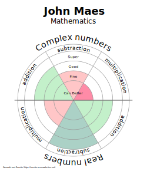

# Rosette

A live example version will be found at https://rosette.azurewebsites.net/

## About

Rosette is a web application to make rosets. An easy way to display and communicate the result of a test to students.
The different parts are displayed in circular diagram witch indicates how well the subject matter is known (see image). 


This application offers an easy way to alter the layout and assist in calculating how good a part is known.
Test results can be imported from a spreadsheet or csv.
## Get started

Install the dependencies...

```bash
npm install
```
And start developing

```bash
npm run dev
```
or create a optimized version for delivery
```bash
npm run build
```
