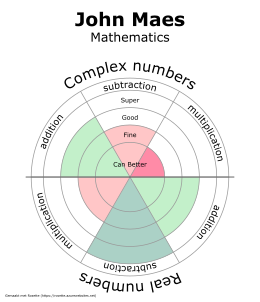

# Rosette

A live example version can be found at https://teunreyniers.github.io/rosette/

## About

Rosette is a web application to make rosettes. A roset is an easy way to display and communicate the result of a test to students.
The different parts are displayed in a circular diagram which indicates how well the subject matter is known (see image). 


This application offers an easy way to alter the layout and assist in calculating how well a part is known.
Test results can be imported from a spreadsheet or CSV.
## Get started

Install the dependencies...

```bash
npm install
```
And start developing

```bash
npm run dev
```
or create an optimized version for delivery
```bash
npm run build
```
